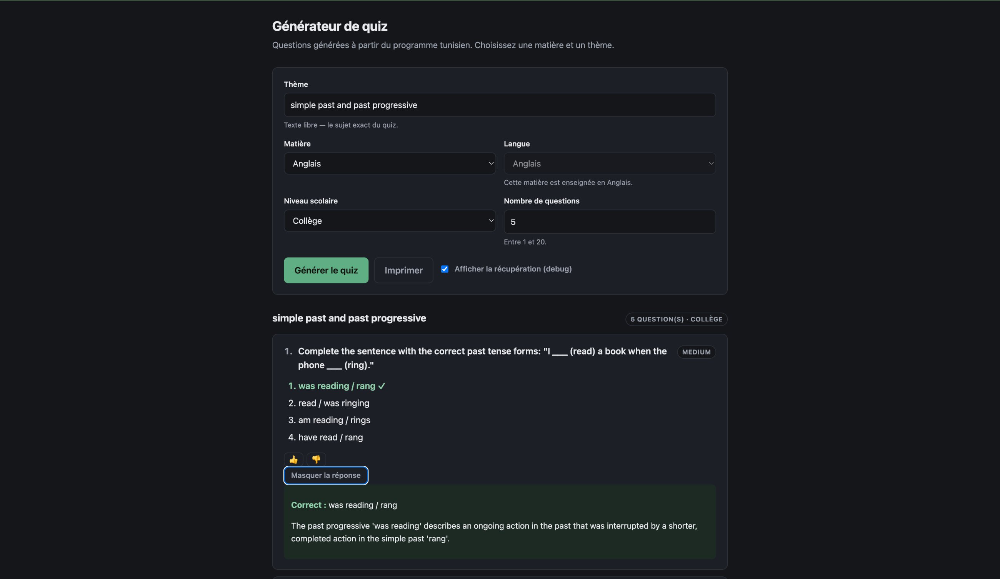
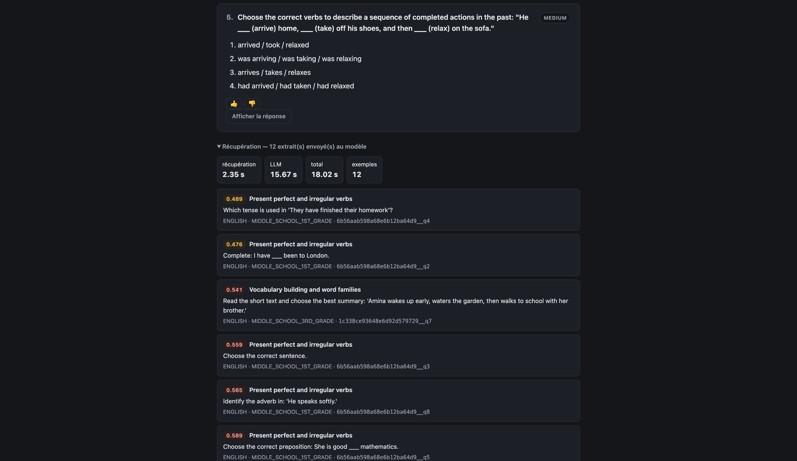
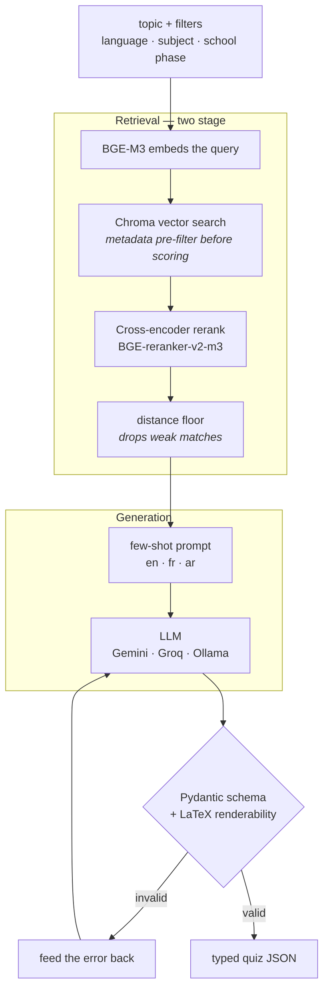

# Quiz Generator — multilingual RAG over a school curriculum

A retrieval-augmented generation service that writes new exam questions in
**English, French and Arabic** across four subjects, grounded in a corpus of
real curriculum questions. Built as a production service: FastAPI, a Chroma
vector store, a cross-encoder reranker, and a measured retrieval eval.

> **About the data.** This was built against a private corpus of ~5,800
> curriculum questions that is not mine to publish, so it isn't here. The
> repository ships a **synthetic sample corpus** (`data/sample/`) that
> exercises the entire pipeline, so you can clone this and run it end to end.
> All quality numbers below were measured on the real corpus.

---

## What it looks like



*Subject, language and school level constrain each other according to the
curriculum rules, so combinations the corpus cannot satisfy are unselectable.*



*The debug panel shows the examples the model actually received, with cosine
distances colour-coded against the quality floor — which is what separates
"the output is bad" from "the retriever fed it the wrong thing".*

> Screenshots are taken against the synthetic sample corpus shipped in this
> repository, so everything visible is generated demo content.

---

## The problem

Teachers need fresh quiz questions. Asking an LLM directly doesn't work: it
invents content that looks plausible but doesn't match how a concept is
actually taught — wrong level, wrong language conventions, wrong definition of
the topic.

So the model doesn't get to decide what a topic means. Retrieval finds real
questions on that topic from the existing curriculum, and those become few-shot
examples. The prompt says it explicitly: *if the examples conflict with what
you think you know, trust the examples.*

## How it works



Two-stage retrieval is the core: a bi-encoder for recall over the whole corpus,
then a cross-encoder that reads (query, candidate) as one input for precision.
Metadata filtering happens *inside* Chroma rather than after, so the phase and
subject constraints narrow the candidate pool before anything is scored.

## Measured retrieval quality

| Cell | N | P@1 | Hit@10 | MRR |
|------|--:|----:|-------:|----:|
| `en × ENGLISH` | 2,761 | 0.735 | 0.871 | 0.784 |
| `ar × ARABIC` | 400 | 0.585 | 0.778 | 0.655 |
| `fr × FRENCH` | 46 | 0.870 | 1.000 | 0.914 |
| `fr × MATHEMATICS` | 720 | 0.615 | 0.735 | 0.649 |
| `ar × MATHEMATICS` | 360 | 0.492 | 0.692 | 0.547 |

Maths sits ~10pp below the language cells. The failure mode is sibling-topic
confusion — asked for "Fonction Logarithme" the retriever returns "Fonctions
affines", which is semantically right and wrong for the task. Mitigated in
production by the school-phase filter. The French number looks excellent and
isn't: 46 test cases over 15 documents. Reporting it honestly is more useful
than hiding it.

Full methodology in [`eval/RESULTS.md`](eval/RESULTS.md).

## Engineering decisions worth reading

**The corpus decides what's possible.** The curriculum constrains which
language a subject is taught in at each level — maths is Arabic in primary and
middle school, French in high school. Rows violating that are mistagged at
source, so [`curriculum_rules.py`](src/data/curriculum_rules.py) drops them at
cleaning time, and the UI encodes the same rules so an impossible request can't
be made.

**Language detection beats the label.** ~15% of rows carry a wrong language
tag. Detection runs on LaTeX-*stripped* text, because normalising `\to` to "to"
and `\infty` to "infinity" injects fake English tokens and breaks stopword
detection on maths content. Subject is a stronger prior than any detector here:
a MATHEMATICS row labelled English is essentially always wrong.

**A doc_id collision was silently eating 6% of the corpus.** Question `order`
repeats within a quiz in ~20% of cases, so `{quiz_id}__q{order}` collided and
Chroma overwrote rows during indexing. Fixed with collision-aware suffixes,
kept backward-compatible with existing eval ground truth.

**Generated LaTeX is validated before it ships.** A walk-based parser catches
unclosed math and over-escaped delimiters — `\\)` tokenises as a line-break
plus a literal paren, not a closing delimiter, so a regex counter over-counts
and misses the bug. Failures feed back into the retry loop with a specific
message.

**One pipeline instance serves every request**, from a thread pool. Anything a
request needs after `generate()` returns travels on the return value, never on
`self` — otherwise concurrent requests overwrite each other's retrieval. The ML
layer is serialised behind a lock; the LLM call deliberately isn't, so
generation stays concurrent.

**Generation quality is measured, not asserted.** `POST /feedback` records
per-question human judgements; `scripts/analyze_feedback.py` joins them to the
runs that produced them and compares retrieval distance against verdict. If bad
questions came from distant chunks, the distance floor is too loose — a config
change with evidence behind it.

## Run it

```bash
git clone <this-repo> && cd quiz-generator
python -m venv .venv && source .venv/bin/activate
pip install -r requirements.txt

# build an index from the synthetic sample corpus (~1 min after model download)
python -m src.data.ingest        --input data/sample/quizzes-sample-raw.json \
                                 --scope configs/phase1_scope.yaml \
                                 --output data/sample/interim/flat.jsonl \
                                 --stats  data/sample/interim/flat_stats.json
python -m src.data.normalize     --input  data/sample/interim/flat.jsonl \
                                 --output data/sample/interim/normalized.jsonl \
                                 --stats  data/sample/interim/normalized_stats.json
python -m src.data.build_index_text --input  data/sample/interim/normalized.jsonl \
                                 --output data/processed/ready_phase1.jsonl \
                                 --stats  data/processed/ready_stats.json
python -m src.indexing.build

# retrieval only — no API key needed
python -m src.retrieval.query "past tense" --language en --top-k 3

# full generation needs a key
echo "GEMINI_API_KEY=..." > .env
set -a; source .env; set +a
python -m src.api          # then open http://localhost:8000/ui
```

The sample corpus deliberately contains messy rows — duplicates, a question
with no correct answer, an image-only question, colliding `order` values, a
curriculum violation — so the cleaning stages have real work to do and the
stats files are worth reading.

Tests run without models, keys or network:

```bash
for t in tests/test_*.py; do python "$t" || break; done
```

## Layout

```
src/data/        ingestion, cleaning, language resolution, curriculum rules
src/indexing/    embedding, Chroma build, taxonomy discovery
src/retrieval/   filtered vector search + cross-encoder rerank
src/generation/  prompts (en/fr/ar), LLM clients, validation + retry
src/pipeline/    orchestrator + CLI
src/api/         FastAPI surface, security, metrics, single-page UI
scripts/         retrieval eval harness, run analysis, feedback analysis
```

## Stack

Python 3.11 · FastAPI · BGE-M3 · BGE-reranker-v2-m3 · ChromaDB · Pydantic v2 ·
Gemini / Groq / Ollama · Docker
