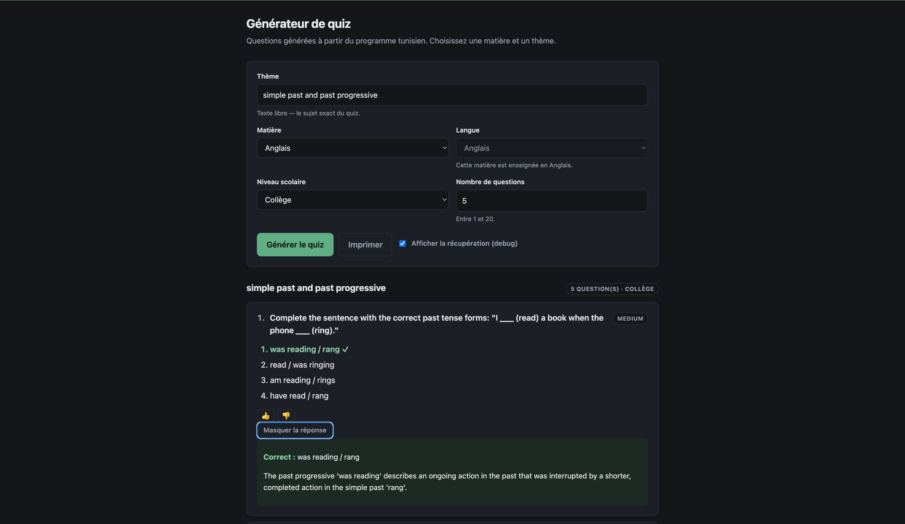
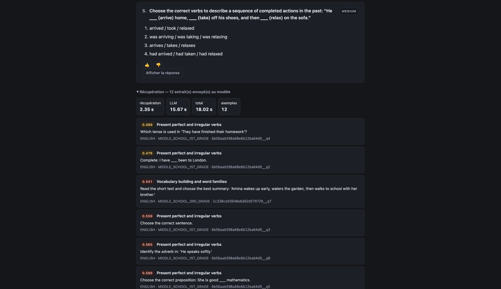
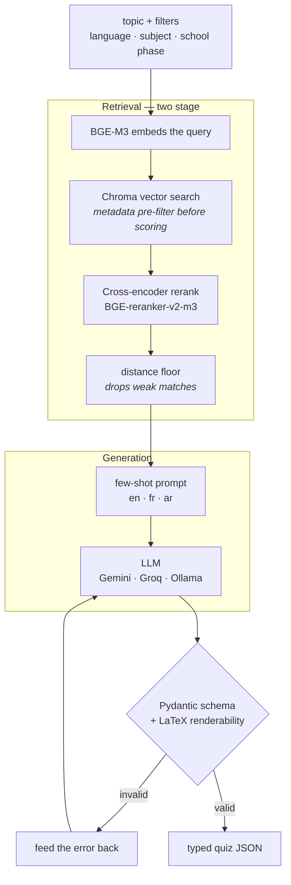

# Quiz Generator

[](https://github.com/Israaelhouch/quiz-generator/actions/workflows/ci.yml)

A retrieval-augmented generation service that produces exam questions in
English, French and Arabic, grounded in a corpus of curriculum questions.
Retrieval supplies real questions on the requested topic as few-shot examples,
so the model follows how a topic is taught rather than its own prior.

Python 3.11 · FastAPI · BGE-M3 · BGE-reranker-v2-m3 · ChromaDB · Pydantic v2 ·
Gemini / Groq / Ollama · Docker

## Overview

A request names a topic, a language, a subject and a school phase. The service
retrieves curriculum questions matching those constraints, passes them to an
LLM as few-shot examples, validates the generated output against a schema, and
returns typed JSON.

The corpus used in development is private: ~5,800 curriculum questions that
cannot be published. A synthetic sample corpus is included in `data/sample/`
and exercises every pipeline stage, so the repository runs end to end from a
clone. The evaluation results below were measured on the private corpus.



Subject, language and school phase constrain each other according to the
curriculum rules in `src/quiz_generator/data/curriculum_rules.py`. Combinations
the corpus cannot satisfy are unselectable rather than rejected after a
request.



The debug panel reports per-stage timings, how many retrieved examples passed
the distance floor, and each chunk sent to the model with its cosine distance.
Screenshots were taken against the synthetic sample corpus (137 indexed
questions).

## Architecture


```mermaid
flowchart TD
    A["topic + filters<br/>language · subject · school phase"] --> B

    subgraph RET ["Retrieval — two stage"]
      B["BGE-M3 embeds the query"]
      B --> C["Chroma vector search<br/><i>metadata pre-filter before scoring</i>"]
      C --> D["Cross-encoder rerank<br/>BGE-reranker-v2-m3"]
      D --> E["distance floor<br/><i>drops weak matches</i>"]
    end

    E --> F

    subgraph GEN ["Generation"]
      F["few-shot prompt<br/>en · fr · ar"]
      F --> G["LLM<br/>Gemini · Groq · Ollama"]
    end

    G --> H{"Pydantic schema<br/>+ LaTeX renderability"}
    H -- invalid --> I["feed the error back"]
    I --> G
    H -- valid --> J["typed quiz JSON"]
```

Retrieval is two-stage: a bi-encoder for recall across the corpus, then a
cross-encoder that scores each (query, candidate) pair for precision. Metadata
filtering is applied inside Chroma before scoring, so subject and school-phase
constraints narrow the candidate pool rather than trimming results afterwards.

One question is one document; the corpus requires no chunking. Correct answers
are excluded from the embedded text so they cannot influence retrieval, and are
supplied to the model separately.

Generated output is validated against a Pydantic schema and a LaTeX
renderability check. Validation failures are fed back into the prompt and
retried up to three times.

The API exposes `/quiz/generate`, `/retrieve`, `/taxonomy`, `/feedback`,
`/health`, `/ready`, `/metrics` and a single-page console at `/ui`. API-key
authentication, per-caller rate limiting, correlation IDs and Prometheus
metrics are built in.

## Evaluation

Retrieval is measured per (language × subject) cell against a ground-truth
answer key, over 4,287 template test cases across five cells.

| Cell | Cases | P@1 | Hit@10 | MRR |
|------|------:|----:|-------:|----:|
| `en × ENGLISH` | 2,761 | 0.806 | 0.875 | 0.828 |
| `ar × ARABIC` | 400 | 0.585 | 0.778 | 0.655 |
| `fr × FRENCH` | 46 | 0.870 | 1.000 | 0.914 |

On a separate set of 50 teacher-phrased questions that do not contain the quiz
title, English P@1 is 0.76 and Hit@10 is 0.94.

Limitations of these numbers:

- The template queries contain the target title, so they measure an easier task
  than production traffic.
- The French cell is 46 cases over 15 documents.
- Some test cases have several valid answers, which caps the maximum reachable
  score per cell.
- The mathematics cells score lower than the language cells; their results are
  reported in `eval/RESULTS.md`.
- The answer keys derive from the private corpus and cannot be published, so
  the table is not independently reproducible. The harness, metrics and
  key validator are in this repository.

Each run records its metrics, the configuration that produced them, the git
commit, and the index it searched. Methodology and per-cell ceilings:
[`eval/RESULTS.md`](eval/RESULTS.md).

## Installation

```bash
make setup        # virtualenv, pinned dependencies, dev tools
make test         # 389 tests; no models, keys or network required
```

Generation requires a provider key. Copy `.env.example` to `.env` and set
`GEMINI_API_KEY`, `GROQ_API_KEY`, or `OLLAMA_HOST` for a local Ollama.
Retrieval requires no key. All 14 environment variables are documented in
`.env.example` and validated at startup.

## Usage

```bash
make run          # builds any missing artefacts, then serves on :8000/ui
```

`make run` wraps `run_local.sh`, which skips any stage whose output already
exists. `make help` lists the remaining targets, including `lint`, `fmt`,
`audit`, `eval` and `clean`.

Pipeline stages, container commands and the evaluation harness are documented
in [`docs/RUNBOOK.md`](docs/RUNBOOK.md).

## Project structure

```
src/quiz_generator/
  data/        ingestion, cleaning, language resolution, curriculum rules
  indexing/    embedding, Chroma build, taxonomy discovery
  retrieval/   filtered vector search and cross-encoder rerank
  generation/  prompts (en/fr/ar), LLM clients, validation and retry
  pipeline/    orchestrator and CLI
  api/         FastAPI surface, security, metrics, single-page console
scripts/       evaluation harness, run analysis, feedback analysis
configs/       model, pipeline, scope and subject-alias configuration
```

## Documentation

| Document | Contents |
|---|---|
| [`docs/RUNBOOK.md`](docs/RUNBOOK.md) | Pipeline stages, containers, evaluation commands |
| [`docs/data_audit.md`](docs/data_audit.md) | Raw corpus audit: integrity findings, scope filters, per-stage row counts |
| [`docs/cells_plan.md`](docs/cells_plan.md) | Which (language × subject) cells ship, are beta, or are out of scope |
| [`eval/RESULTS.md`](eval/RESULTS.md) | Retrieval metrics per cell, ceilings, realistic-question results |
| [`docs/DECISIONS.md`](docs/DECISIONS.md) | Architecture decision records |
| [`CHANGELOG.md`](CHANGELOG.md) | Release history |

## License

[MIT](LICENSE). The synthetic sample corpus in `data/sample/` is covered by the
same licence. The curriculum corpus used in development is not part of this
repository.
